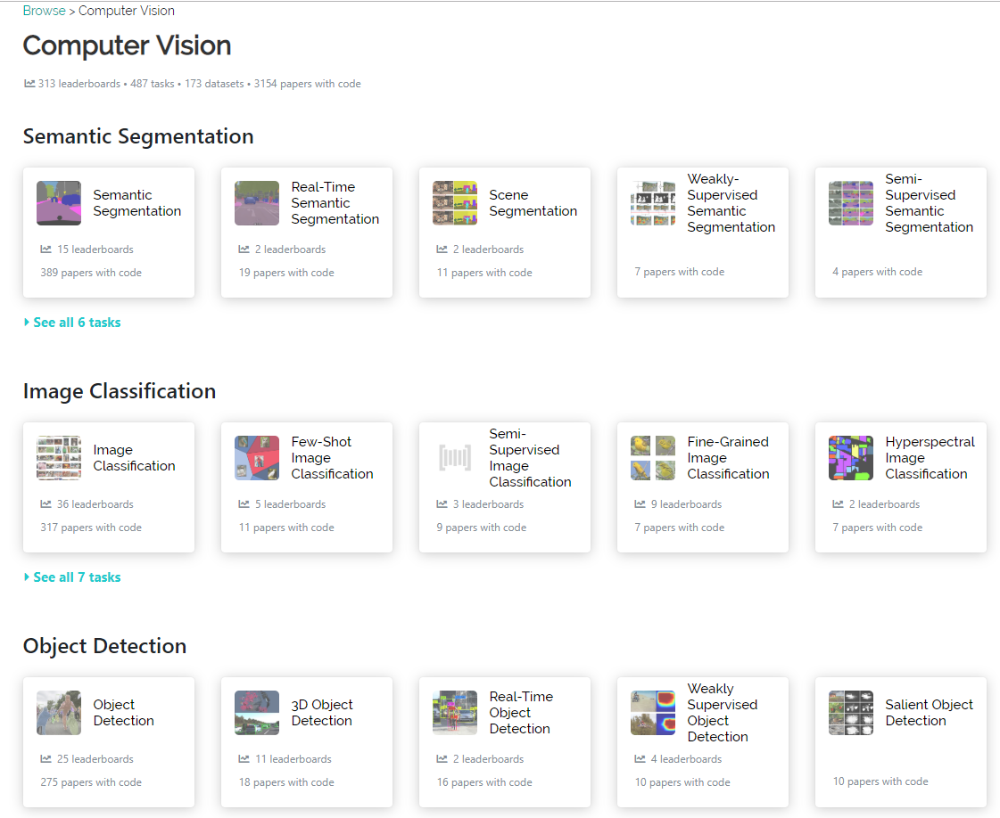

# study-source-CVer-
CV学习资源
## 1.paper switch code 和 cv state-of-the-art
https://paperswithcode.com/sota

## 2.人脸识别
https://github.com/ChanChiChoi/awesome-Face_Recognition

## 3.CV2019
https://github.com/amusi/CVPR2019-Code
